# 인구 밀도 예측 CNN 모델 (Population Density Prediction CNN Model)

## 📖 프로젝트 개요

**대한민국의 한 도시**의 2022년 2월 한 달간 유동인구 데이터(남성, 25-29세)를 이용하여 특정 시간대의 인구 분포를 예측하는 딥러닝 모델 개발 프로젝트입니다. **CNN(Convolutional Neural Network)** 모델을 사용하여 **지난 3시간 동안의 공간적 인구 분포 패턴**을 학습하고, 이를 바탕으로 **다음 1시간 후의 인구 분포 맵을 예측**하는 것을 목표로 합니다.

⚠️ **참고:** 이 프로젝트에 사용된 원본 데이터는 비공개 데이터이므로 저장소에 포함되어 있지 않으며, 공유가 불가능합니다.

## 📊 데이터셋

* **원본 데이터:** 특정 도시의 유동인구 데이터 (CSV)
* **형식:** 시간 및 공간 기반의 2차원 격자 데이터 (72x49 그리드)
* **내용:** 특정 날짜, 시간, 성별, 연령대의 인구 분포를 2D 맵으로 표현
* **기간:** 2022년 2월 1일 ~ 28일 (1달치)
* **단위:** 1시간 단위
* **사용 데이터:** 남자(m) 데이터만 사용
* **데이터 분할:**
    * **학습 데이터:** 2월 1일 ~ 24일
    * **검증 데이터:** 2월 25일 ~ 27일
    * **테스트 데이터:** 2월 28일

### 데이터 분석 요약
* 주간/주말 패턴, 출퇴근 시간대 등 시간 흐름에 따른 인구 변화 패턴이 관찰되었습니다.


## ⚙️ 데이터 전처리 (`main.py` 기준)

1.  **데이터 로딩 및 정렬:** `miniData` 폴더 내 남성 인구 데이터 CSV 파일 목록(`_m_` 포함)을 불러와 날짜, 시간 순으로 정렬합니다.
2.  **최소/최대값 계산:** 전체 데이터셋(`file_list`)에서 인구수의 최소값(`data_min`)과 최대값(`data_max`)을 계산하여 정규화 기준으로 사용합니다.
3.  **정규화 (Min-Max Scaling):** 각 CSV 파일을 읽어 NumPy 배열로 변환한 후, 이전 단계에서 계산된 최소/최대값을 이용해 0과 1 사이의 값으로 정규화(`arr_norm`)합니다. 메타 정보(날짜, 시간 등)와 함께 DataFrame(`df`)으로 구성하고 정렬합니다.
4.  **시계열 시퀀스 생성 (Sliding Window):** 정렬된 데이터(`df`)를 윈도우 슬라이싱 방식(`build_sequences`)으로 처리하여 입력(X)과 출력(y) 시퀀스를 생성합니다.
    * **입력(X):** 연속된 3시간(`window_size=3`)의 정규화된 인구 분포 맵 (형태: `(3, 72, 49)`).
    * **출력(y):** 다음 1시간 후의 정규화된 인구 분포 맵 (형태: `(72, 49)`).
    * 동일 날짜 내에서 시간이 연속되는 경우에만 시퀀스를 생성합니다 (`bestModelTest.py`의 `build_sequences_cross_day`는 날짜 경계 처리 로직이 추가됨).
5.  **데이터셋 분할:** 날짜(`meta_df['date']`)를 기준으로 학습(1-24일), 검증(25-27일), 테스트(28일) 데이터셋으로 분리합니다 (`split_data` 함수).
6.  **데이터 재구성 (Reshape):** CNN 모델 입력 형식에 맞게 데이터 형태를 변경합니다 (`split_data` 함수 내).
    * **X:** `(batch_size, height=72, width=49, channels=3)` (채널 축이 마지막으로 이동).
    * **y:** `(batch_size, height=72, width=49, channels=1)`.

## 🛠️ 모델 구조 (CNN) (`main.py` 기준)

TensorFlow Keras를 사용하여 CNN 모델(`build_model` 함수)을 구축했습니다.

* **입력 레이어:** `Input(shape=(72, 49, 3))`
* **Convolutional Blocks (Conv2D + MaxPooling2D):**
    * `Conv2D(32 filters, kernel_size=3, activation='relu', padding='same')` + `MaxPooling2D(pool_size=2)`
    * `Conv2D(64 filters, kernel_size=3, activation='relu', padding='same')` + `MaxPooling2D(pool_size=2)`
    * `Conv2D(128 filters, kernel_size=3, activation='relu', padding='same')` + `MaxPooling2D(pool_size=2)`
    * `Conv2D(256 filters, kernel_size=3, activation='relu', padding='same')` + `MaxPooling2D(pool_size=2)`
    * `Conv2D(256 filters, kernel_size=3, activation='relu', padding='same')`
* **Flatten 레이어:** `Flatten()`
* **Dropout 레이어:** `Dropout(0.5)` (과적합 방지)
* **출력 레이어 (Dense):** `Dense(72*49, activation='linear')`
* **Reshape 레이어:** `Reshape((72, 49, 1))` (최종 출력 형태 맞춤)

### 컴파일 설정
* **Optimizer:** `Adam`
* **Loss Function:** `Mean Squared Error (mse)` (회귀 문제에 적합)

## ⚙️ 학습 과정 (`main.py` 기준)

* **Epochs:** 200
* **Batch Size:** 32
* **Callbacks:**
    * `ModelCheckpoint`: 검증 손실(`val_loss`)이 가장 낮은 모델을 `best_model.keras`로 저장합니다.
* 학습 데이터(`X_train`, `y_train`)와 검증 데이터(`X_val`, `y_val`)를 사용하여 모델을 학습시켰습니다 (`train_model` 함수).

## 📈 결과

### 학습 곡선 (Training & Validation Loss)


* 학습 초반(약 10-20 epoch)에 손실 값이 급격히 감소한 후 안정적으로 수렴하는 양상을 보입니다.
* 학습 손실(train\_loss)과 검증 손실(val\_loss)이 유사한 패턴으로 감소하며 최종적으로 낮은 수준에서 거의 일치하여, 과적합 없이 모델이 잘 학습되었음을 나타냅니다.

### 테스트 데이터 예측 결과 시각화 (`bestModelTest.py` 결과)
2월 28일 테스트 데이터에 대한 예측 결과입니다. (왼쪽: 실제값, 가운데: 예측값, 오른쪽: 오차(절대값))


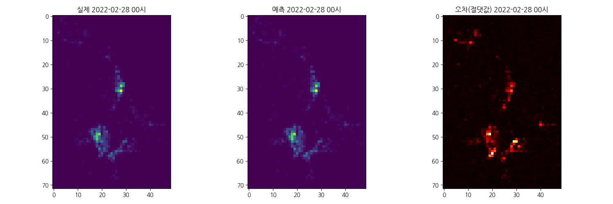

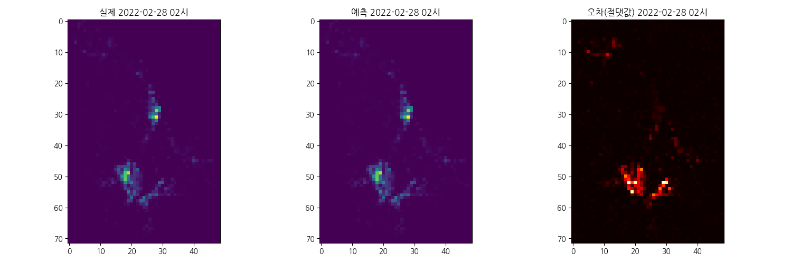
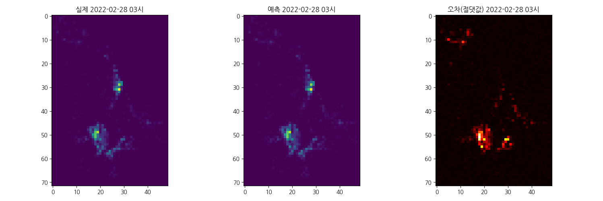
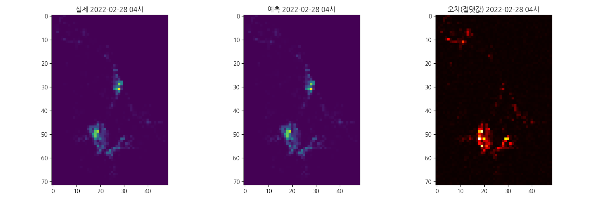
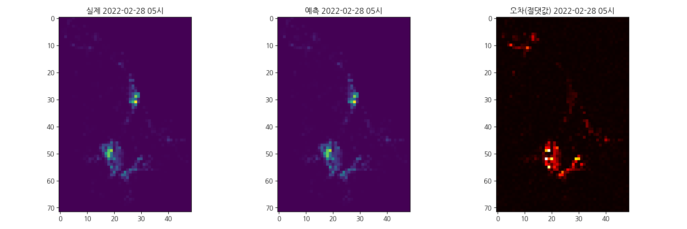
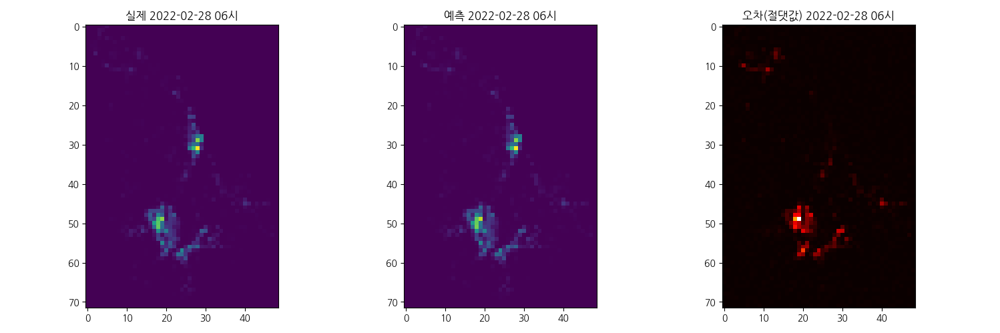

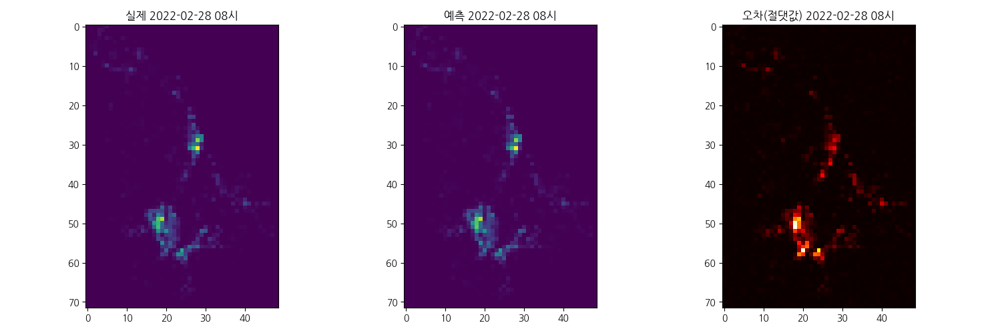
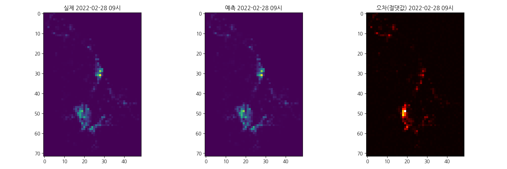

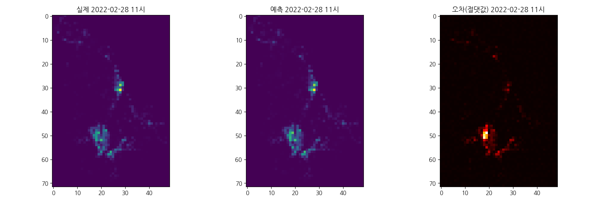
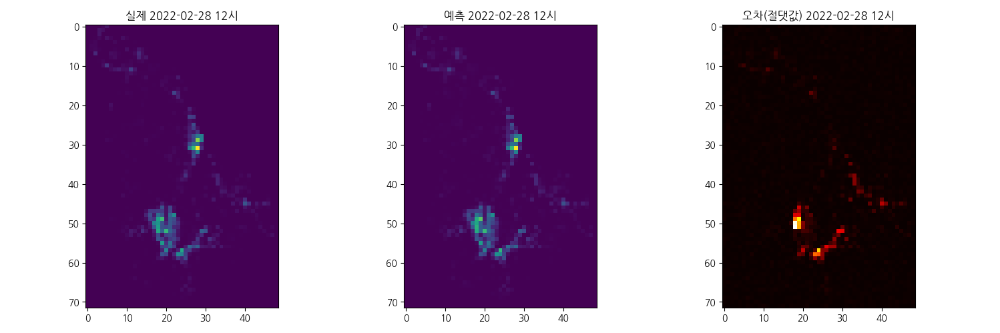


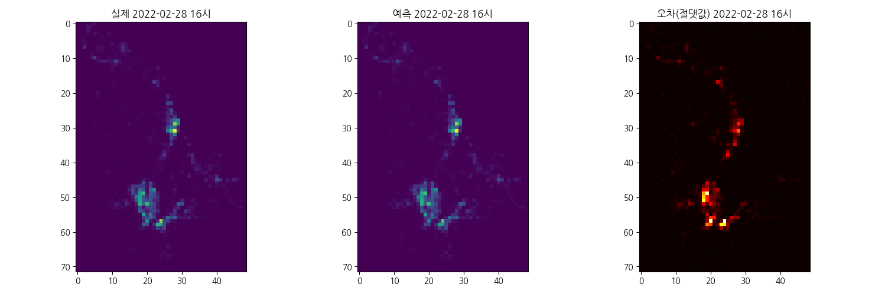
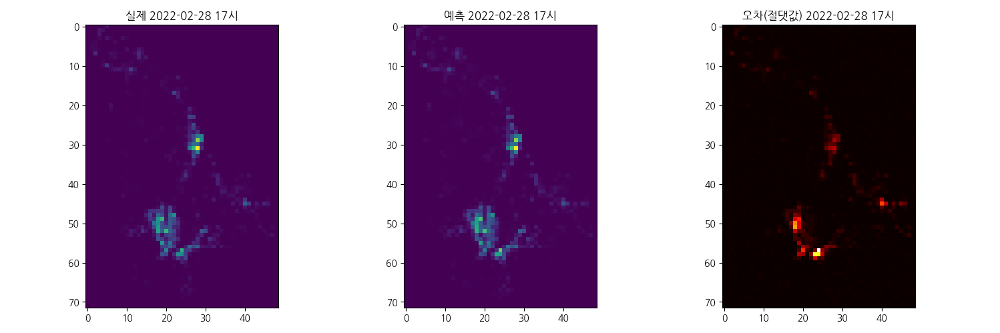
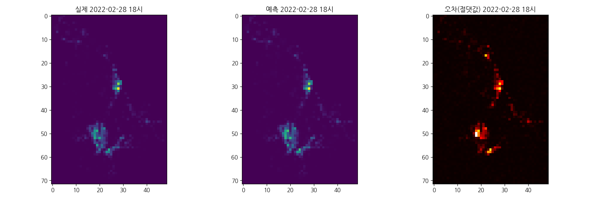


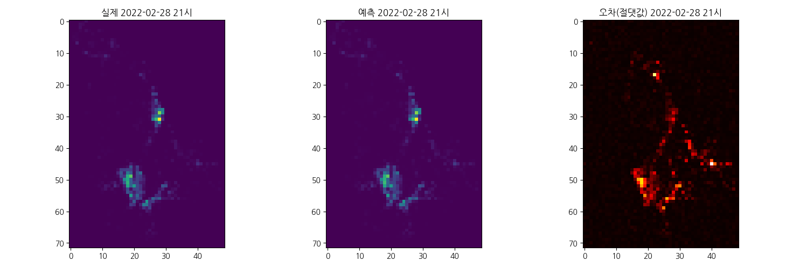

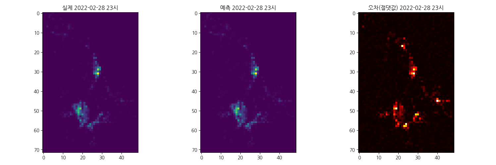

* 전반적으로 모델이 시간대별 인구 분포 패턴을 잘 예측하는 것을 시각적으로 확인할 수 있습니다. 오차 맵에서 밝은 부분은 예측 오차가 큰 지역을 나타냅니다.

## 🚀 실행 방법

1.  **저장소 복제:**
    ```bash
    git clone [https://github.com/chakihwan/population-prediction-cnn-model.git](https://github.com/chakihwan/population-prediction-cnn-model.git)
    cd population-prediction-cnn-model
    ```
2.  **데이터셋 준비:**
    * **⚠️ 중요:** 이 프로젝트에 사용된 원본 데이터는 비공개이므로, 이 저장소에는 포함되어 있지 않습니다. 코드를 실행하려면 동일한 형식(파일명 규칙, CSV 구조)의 데이터가 `miniData` 폴더에 준비되어 있어야 합니다.
3.  **필요 라이브러리 설치:**
    ```bash
    pip install tensorflow numpy pandas matplotlib
    ```
4.  **(선택) 데이터 분석 스크립트 실행:** (`analysis_m.py`)
    * 데이터 분포, 시간대별/요일별 패턴 등을 시각화하여 확인합니다.
    ```bash
    python analysis_m.py
    ```
5.  **모델 학습 및 평가 스크립트 실행:** (`main.py`)
    * 데이터 로드, 전처리, 모델 구축, 학습, 평가를 순차적으로 수행합니다.
    * 학습 중 가장 성능이 좋은 모델(검증 손실 기준)은 `best_model.keras`로 저장됩니다.
    * 학습 완료 후 손실 그래프가 표시됩니다.
    ```bash
    python main.py
    ```
6.  **(선택) 특정 시간 예측 스크립트 실행:** (`bestModelTest.py`)
    * 저장된 `best_model.keras` 모델을 로드하여 테스트 데이터셋 중 특정 시간대의 예측 결과를 시각화합니다.
    * 스크립트 내 `target_hour` 변수를 수정하여 원하는 시간(예: '00', '15', '23')을 지정할 수 있습니다.
    ```bash
    python bestModelTest.py
    ```
